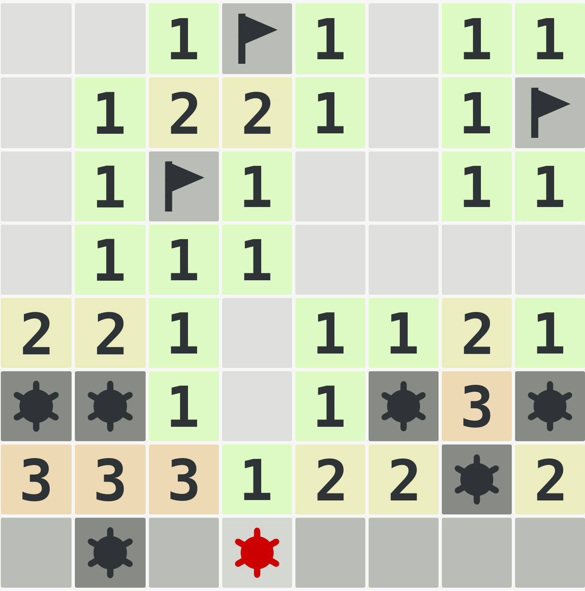

# MineSweeper with SAT

Field is `m x n` rectangle with cells containing either a number `'0' .. '8'` of mines nearby, or `'?'` meaning that the content of a cell is unknown. A cell also could be marked with `'b'` that stands for a bomb.

SAT solver is able to tell whether a given cell is safe to click or not, given partial information about the field. E.g. the following snippet

### Note: `i,j` are 0-based indexes
```C++
auto field = std::vector<std::vector<char>>();
    field.push_back(std::vector<char>({'0','0','1','b','1','0','1','1'}));
    field.push_back(std::vector<char>({'0','1','2','2','1','0','1','b'}));
    field.push_back(std::vector<char>({'0','1','b','1','0','0','1','1'}));
    field.push_back(std::vector<char>({'0','1','1','1','0','0','0','0'}));
    field.push_back(std::vector<char>({'2','2','1','0','1','1','2','1'}));
    field.push_back(std::vector<char>({'?','?','1','0','1','?','3','?'}));
    field.push_back(std::vector<char>({'3','3','3','1','2','2','?','2'}));
    field.push_back(std::vector<char>({'?','?','?','?','?','?','?','?'}));


    auto solver = MineSweeper(field);

    for (int i = 0; i < 8; i++) {
        for (int j = 0; j < 8; j++) {
            if (field[i][j] == '?') {
                if(solver.query(i,j) == SAFE) {
                    std::cout << "Row " << i << ", Col " << j << " " << SAFE << std::endl;
                } else {
                    std::cout << "Row " << i << ", Col " << j << " " << BOOM << std::endl;
                }
            }
        }
    }
```

will yield 
```bash
Row 5, Col 0 BOOM
Row 5, Col 1 BOOM
Row 5, Col 5 BOOM
Row 5, Col 7 BOOM
Row 6, Col 6 BOOM
Row 7, Col 0 SAFE
Row 7, Col 1 BOOM
Row 7, Col 2 SAFE
Row 7, Col 3 BOOM
Row 7, Col 4 SAFE
Row 7, Col 5 SAFE
Row 7, Col 6 SAFE
Row 7, Col 7 SAFE
```
given partial information `field` whereas the real situation is:




i.e. solver tells the locations of the mines correctly.